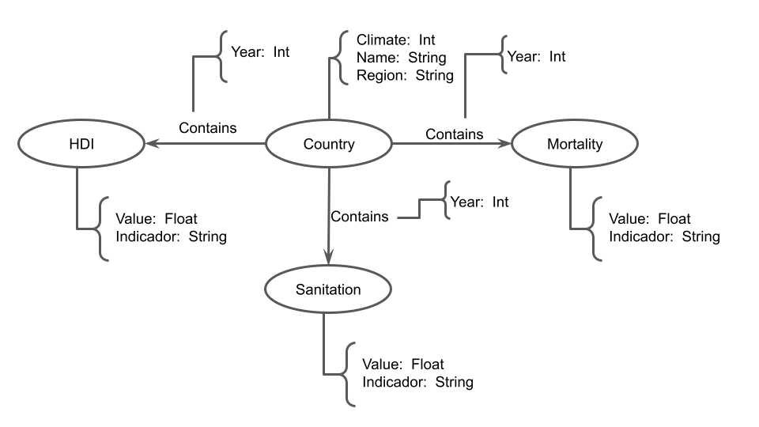

# Lab07 - Modelo Lógico para Banco de Dados de Grafos

# Aluno
* `217332`: `Guilherme Tezoli Bakaukas`

## Modelo Lógico do Banco de Dados de Grafos

>
> 

## Perguntas de Pesquisa/análise

> Liste aqui as três perguntas de pesquisa/análise
> * Qual o melhor valor de IDH de um país durante o período de 2000 a 2016?
> * Qual país possui o menor índice de população com ao menos o básico de saneamento(análise anual)? Qual IDH desse país?
> * Países com taxas acima da média de mortalidade por suicídio, apresentam IDH abaixo da média (análise anual)? Qual a proporção em que isso ocorre? 
